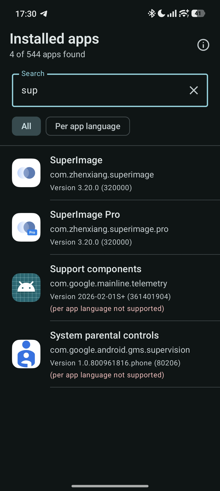
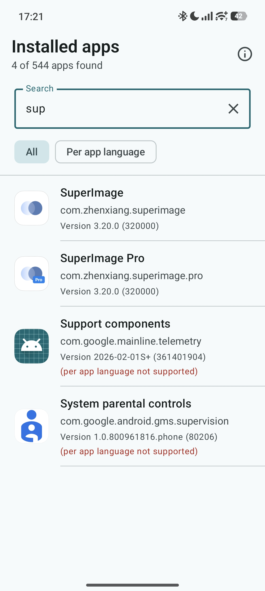
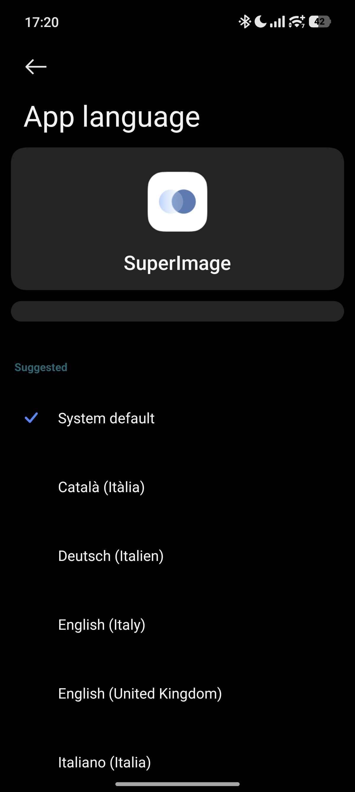
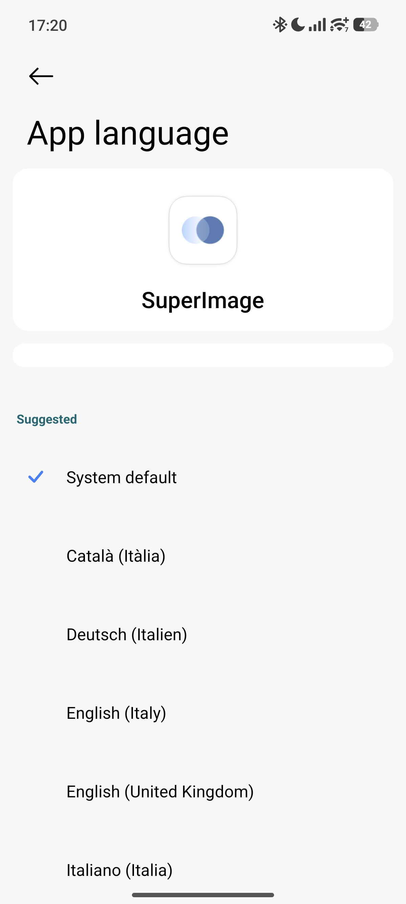

# App Language Control

App Language Control is a small Android utility for opening the per-app language settings screen for installed apps that support Android's app-specific language feature.

## Why this exists

Android 13 added per-app language preferences to AOSP, letting users choose a different language for individual apps without changing the whole system language. Manufacturers like Xiaomi, POCO, Redmi and Infinix hide or make this settings page difficult to reach even though the underlying Android capability is still present.

## Core feature

- Lists installed apps on the device.
- Detects which apps declare support for per-app languages.
- Lets you search and filter the app list.
- Opens Android's built-in per-app language settings for a selected supported app.

The app does not translate apps or force unsupported apps to expose languages. It links to the native Android settings screen for apps that already provide a valid locale configuration.

## Screenshots

 

 

## Requirements

- Android 13 or newer.
- An app must support Android's per-app language API to be configurable.
